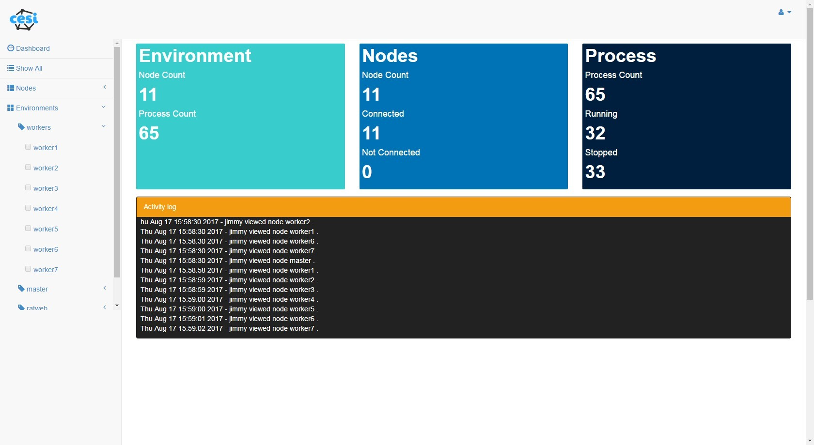
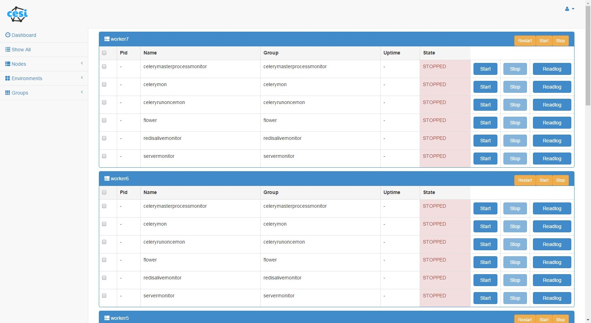

# supervisoradmin
Supervisor admin is a centralized management tools written by django.
This project was forked from [cesi](https://github.com/gamegos/cesi.git) .
The original project was written by flask, This project is a django version. 
# screenshots

 


 

# Installation
```sh
$git clone https://github.com/jimmy201602/supervisoradmin.git

$cd supervisoradmin-master

$pip install -r  requirements.txt

$python manage.py makrmigrations

$python manage.py migrate

$python manage.py createsuperuser
```
# Configuration

```sh
vi superadmin.cfg
```

# Run Project

```sh
python manage.py runserver
```

# Mailing list

```sh
zhengge2012@gmail.com
```

# Usage

[cesi blog](http://www.gulsahkose.com/2014/09/cesi-centralized-supervisor-interface.html) 
